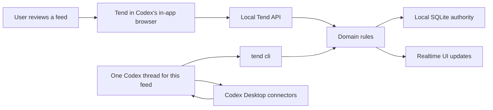

# Tend

Tend is an open-source, local-first feed workspace built for Codex Desktop. It is intended to run
inside Codex's in-app browser: the browser UI is where you review and steer a feed, while one
dedicated Codex thread operates that feed through Tend's local CLI.

Tend is not a hosted agent or connector service. Its state stays on your machine. Gmail, GitHub,
Slack, browser automation, and other connector credentials remain in Codex Desktop.

## The Core Model

Every feed has two parts:

1. **A Tend view in Codex's in-app browser** for reviewing cards, approving actions, editing prompts,
   and giving feedback.
2. **One dedicated Codex thread** that collects sources, drains queued work, records results, and
   runs the feed's heartbeat.

Do not reuse one Codex thread across several feeds. The thread is the feed's operator and durable
working context.



## Quick Start

### 1. Start Tend

Download the latest archive from [GitHub Releases](https://github.com/EveryInc/tend/releases), then
unpack and start it:

```sh
tar -xzf tend-<version>-<platform>-<arch>.tar.gz
cd tend-<version>-<platform>-<arch>
./tend start
```

Confirm the local runtime is healthy:

```sh
./tend health
./tend doctor
```

Tend serves the UI and API from:

```text
http://127.0.0.1:4332
```

Open that URL in **Codex Desktop's in-app browser**. A normal browser is useful for development, but
the intended product flow keeps Tend beside the Codex threads that operate its feeds.

macOS release binaries are not Apple Developer ID signed or notarized yet. If Gatekeeper warns on
first launch, open the binary explicitly from Finder or remove the quarantine attribute:

```sh
xattr -d com.apple.quarantine ./tend
./tend start
```

### 2. Choose Or Create A Feed

Inbox is ready to configure on first launch. To make another feed, open the feed menu, choose
**Create a feed**, and describe what it should notice in plain English.

Tend creates the local feed immediately. It does not create or activate a Codex thread for you.

### 3. Connect One Codex Thread

Create a fresh Codex Desktop thread specifically for the feed. Then print that feed's setup prompt:

```sh
./tend setup codex --feed inbox
```

Paste the complete output into the new thread. The prompt tells Codex to bind that thread to the
feed, install or update one heartbeat, use Tend's local CLI contract, and process queued work before
refreshing sources.

Repeat this step for every feed, changing the feed id:

```sh
./tend setup codex --feed ai-research
```

### 4. Activate The Feed

The setup prompt asks the thread to handle the feed once immediately. After that, the heartbeat can
wake it automatically.

Manually open or wake the same feed thread and say:

```text
go deal with the feed
```

Use that manual activation for the first run, after a paused or missing heartbeat, or whenever you
want an immediate sweep. Keep one thread per feed so the command always has an unambiguous target.

## Run From Source

Use the source path when you want to inspect, modify, or extend Tend.

Prerequisites:

- Bun 1.3.11 or newer
- Node.js 22 or newer
- pnpm 9.15.4, enabled through Corepack or installed directly

```sh
git clone https://github.com/EveryInc/tend.git
cd tend
corepack enable
pnpm install
pnpm start
```

Open `http://127.0.0.1:4321` in Codex Desktop's in-app browser. Vite serves the UI on `4321` and
proxies `/api` to the local API on `4332`.

The source equivalent of the setup command is:

```sh
pnpm tend -- setup codex --feed inbox
```

## Runtime Commands

```sh
./tend version
./tend status
./tend health
./tend doctor
./tend logs
./tend restart
./tend stop
```

Use foreground mode while debugging:

```sh
./tend start --foreground
```

The pre-release `attention` command remains as a compatibility alias. New documentation and release
artifacts use the fixed product name, Tend.

## Local Data

Runtime data remains under `~/.attention/` by default for compatibility:

```text
~/.attention/
  attention.db
  data/
  logs/
  exports/
```

Set `ATTENTION_HOME` to use another runtime root:

```sh
ATTENTION_HOME=.local-tend ./tend start
```

SQLite is the runtime authority. The `data/` directory keeps readable mirrors and immutable raw
evidence snapshots for backup compatibility and local debugging.

Back up and restore:

```sh
tend backup export ./tend-backup
tend stop
tend backup import ./tend-backup
```

Exports require a new destination and never delete an existing path. Imports are staged before the
current data is swapped, and Tend refuses to import while the same runtime is active.

See [docs/DATA.md](./docs/DATA.md) for the full storage map.

## iPhone App

Tend includes an optional native iPhone review client. It mirrors configured feeds through a private
Supabase project. The Mac remains authoritative: the phone reviews cached projections and records
commands, while the local Tend runtime validates and imports those commands through the same domain
rules used by the web app and CLI.

The SwiftUI project, database migration, and production setup are documented in
[docs/IOS.md](./docs/IOS.md).

## CLI Contract

Codex operates feeds through the low-level JSON CLI:

```sh
tend cli state --feed inbox
tend cli work:list --feed inbox --thread <current-codex-thread-id>
tend cli work:claim --feed inbox --thread <current-codex-thread-id>
```

The JSON CLI is the v0 agent contract for feed setup, work claiming, card and source recording,
policy revisions, feedback, and runtime inspection. See
[docs/AGENT_CONTRACT.md](./docs/AGENT_CONTRACT.md) and [docs/SKILL.md](./docs/SKILL.md).

## Development

Core checks:

```sh
pnpm check
pnpm build
pnpm tend:build
pnpm tend:smoke
pnpm tend:package
```

`pnpm check` runs typecheck, Oxlint, and Bun tests. `pnpm tend:smoke` validates the compiled binary
against a temporary runtime home.

Seed a scrubbed demo feed:

```sh
pnpm seed:demo
```

## Documentation

- [docs/INSTALL.md](./docs/INSTALL.md): install and first-run details
- [docs/ARCHITECTURE.md](./docs/ARCHITECTURE.md): local runtime and ownership boundaries
- [docs/AGENT_CONTRACT.md](./docs/AGENT_CONTRACT.md): Codex/CLI workflow
- [docs/DATA.md](./docs/DATA.md): storage, mirrors, backup, and restore
- [docs/DEVELOPMENT.md](./docs/DEVELOPMENT.md): local development commands and CI
- [docs/IOS.md](./docs/IOS.md): native iPhone app, Supabase bridge, and device setup
- [docs/RELEASING.md](./docs/RELEASING.md): release lifecycle
- [RUNBOOK.md](./RUNBOOK.md): feed-thread operator guide
- [CAPABILITY_MAP.md](./CAPABILITY_MAP.md): user-visible actions mapped to Codex primitives
- [CONTRIBUTING.md](./CONTRIBUTING.md): contribution expectations
