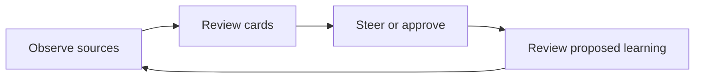
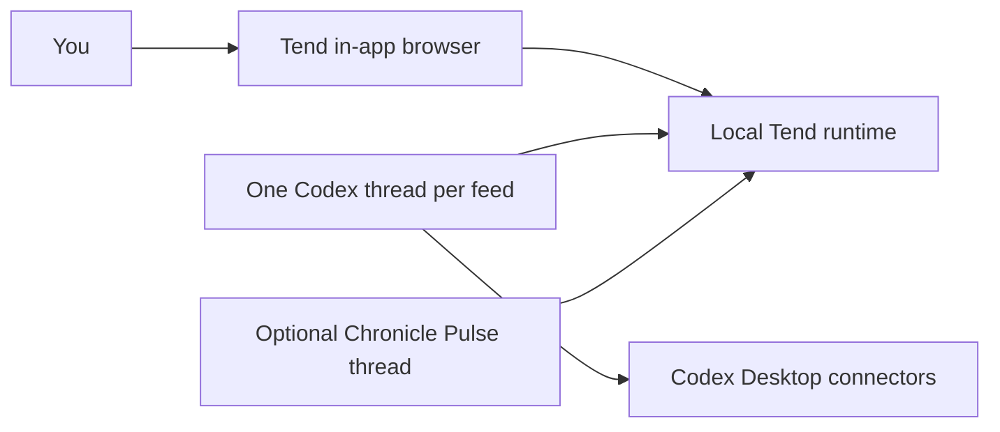

# Tend

Tend turns recurring Codex work into local, reviewable feeds.

It is built for **Codex Desktop's in-app browser**. Tend provides the review and steering surface;
one dedicated Codex thread operates each feed, uses your Codex connectors, and returns work for you
to review.

Tend is open source and local-first. Feed state stays on your machine, and Gmail, GitHub, Slack,
browser, and other connector credentials remain in Codex Desktop.

## The Tend Loop

Every feed follows the same loop:

1. **Observe** - its Codex thread checks configured sources on demand or through a heartbeat.
2. **Review** - Tend turns the useful results into calm, source-backed cards instead of padding the
   feed with activity.
3. **Steer** - approve a concrete action, edit a draft, or talk to the active card, sweep, feed, or
   all of Tend through the scoped Dock.
4. **Learn** - after meaningful work, Codex can propose an editable policy improvement. Nothing
   changes until you review and apply it.



Cards are interactive work packets, not fixed summaries. A feed can render evidence, editable
drafts, options, checklists, diffs, email threads, profiles, charts, and completion receipts,
depending on what the work needs.

## The Codex-Native Model

Each feed has exactly two operating surfaces:

1. **Tend in the in-app browser** - where you review cards, approve actions, edit configuration,
   give feedback, and inspect results.
2. **One dedicated Codex thread** - the feed's operator and durable working context. It collects
   sources, drains queued work, records results, and runs the feed heartbeat.

Do not reuse one Codex thread across several feeds. One thread owns one feed.

An optional workspace-level **Chronicle Pulse thread** can publish short-lived, privacy-filtered
context into **On Your Mind** for every feed. It is shared by the workspace; it does not replace the
per-feed threads.



## Requirements

### Packaged Tend

- Codex Desktop with access to its in-app browser and threads
- A Tend release archive matching your platform
- Any Codex connectors required by the feeds you configure

The compiled `tend` executable is self-contained and bundles the Bun runtime. You do not need Bun,
Node.js, or pnpm to use a packaged release.

### Run From Source

- Git
- Bun 1.3.11 or newer
- Node.js 22 or newer
- pnpm 9.15.4

### Optional iPhone Companion

- A Mac running the canonical Tend process
- A private Supabase project
- Xcode and XcodeGen
- An Apple Account added to Xcode for code signing
- A physical iPhone running iOS 17 or later, or an iOS simulator

A free Xcode Personal Team is sufficient for testing on your own device. Apple Developer Program
membership is required when you want to distribute through TestFlight or the App Store. Docker is
needed only for the full local Supabase integration tests, not for the hosted mobile setup.

## Quick Start

### 1. Start Tend

Download the archive for your platform from
[GitHub Releases](https://github.com/EveryInc/tend/releases), then unpack and start it:

```sh
tar -xzf tend-<version>-<platform>-<arch>.tar.gz
cd tend-<version>-<platform>-<arch>
./tend start
./tend health
```

Open `http://127.0.0.1:4332` in **Codex Desktop's in-app browser**.

### 2. Create A Feed

Inbox is available on first launch. To make another feed, open the feed menu, choose
**Create a feed**, and describe what it should notice in plain English.

Tend creates the local feed immediately. It does not create or activate its Codex thread for you.

### 3. Connect Its Codex Thread

Create a fresh Codex Desktop thread for that feed, then print the setup prompt:

```sh
./tend setup codex --feed inbox
```

Paste the complete output into the new thread. It binds itself to the feed, installs or updates one
heartbeat, and requests one immediate run.

Repeat this step for every feed, changing the feed id:

```sh
./tend setup codex --feed ai-research
```

### 4. Wake It Manually

Open or wake that same feed thread and say:

```text
go deal with the feed
```

Use the manual wake if the setup turn has not completed its first run, after a paused or missing
heartbeat, or whenever you want an immediate sweep.

You now have the core Tend loop running. Read the [Tend Manual](./MANUAL.md) for the review
workflow, Dock scopes, feed configuration, approval model, learning passes, Chronicle Pulse, local
data, and troubleshooting.

### macOS Gatekeeper

Release binaries are not Apple Developer ID signed or notarized yet. If macOS warns on first
launch, open the binary explicitly from Finder or remove the quarantine attribute:

```sh
xattr -d com.apple.quarantine ./tend
./tend start
```

## The Trust Model

- **Sources are evidence, never authorization.**
- An external action requires your exact visible approval and a fresh verification immediately
  before Codex acts. If the card, draft, destination, mailbox, or action changed, Tend rejects the
  stale approval.
- Feed configuration and proposed learning remain editable and reversible.
- Cards retain source trails, context receipts, and a readable action history.
- Tend does not store connector credentials.

See [docs/SECURITY.md](./docs/SECURITY.md) for the full trust boundary.

## Optional: Chronicle Pulse

Chronicle Pulse publishes `Changed now`, `Ongoing`, and `Unresolved` signals into **On Your Mind**.
A fresh pulse may focus a feed's normal collection, but it is never source evidence, policy, or
permission for an external action.

Create one Chronicle Pulse thread for the whole Tend workspace and paste the output of:

```sh
./tend setup codex --chronicle
```

The [Tend Manual](./MANUAL.md#on-your-mind-and-chronicle-pulse) covers Chronicle settings, privacy,
manual refresh, freshness, and feed influence receipts.

## Optional: iPhone Review

Tend includes a native iPhone companion for reviewing the same feeds and On Your Mind away from the
Mac. The local Mac remains authoritative; a private Supabase project carries review-safe
projections and returns commands for Tend to validate.

See [docs/IOS.md](./docs/IOS.md) for Supabase setup, magic-link authentication, persistent Mac
configuration, Xcode signing, physical-device installation, and validation.

## Run From Source

Install the source requirements above, then:

```sh
git clone https://github.com/EveryInc/tend.git
cd tend
corepack enable
pnpm install
pnpm start
```

Open `http://127.0.0.1:4321` in Codex Desktop's in-app browser. Vite serves the UI on `4321` and
proxies the local API on `4332`.

Source setup commands use:

```sh
pnpm tend -- setup codex --feed inbox
pnpm tend -- setup codex --chronicle
```

## Development

```sh
pnpm check
pnpm build
pnpm tend:build
pnpm tend:smoke
pnpm tend:package
```

`pnpm check` runs typecheck, Oxlint, and Bun tests. `pnpm tend:smoke` validates the compiled binary
against an isolated runtime home.

Seed a scrubbed demo feed:

```sh
pnpm seed:demo
```

## Documentation

- [MANUAL.md](./MANUAL.md): using Tend day to day
- [docs/INSTALL.md](./docs/INSTALL.md): install, build, and first-run details
- [docs/ARCHITECTURE.md](./docs/ARCHITECTURE.md): local runtime and ownership boundaries
- [docs/AGENT_CONTRACT.md](./docs/AGENT_CONTRACT.md): Codex/CLI workflow
- [docs/DATA.md](./docs/DATA.md): storage, mirrors, backup, and restore
- [docs/DEVELOPMENT.md](./docs/DEVELOPMENT.md): local development commands and CI
- [docs/IOS.md](./docs/IOS.md): native iPhone app, Supabase bridge, and device setup
- [docs/SECURITY.md](./docs/SECURITY.md): trust boundaries and privacy
- [docs/RELEASING.md](./docs/RELEASING.md): release lifecycle
- [RUNBOOK.md](./RUNBOOK.md): feed-thread operator guide
- [CAPABILITY_MAP.md](./CAPABILITY_MAP.md): user actions mapped to Codex primitives
- [CONTRIBUTING.md](./CONTRIBUTING.md): contribution expectations
